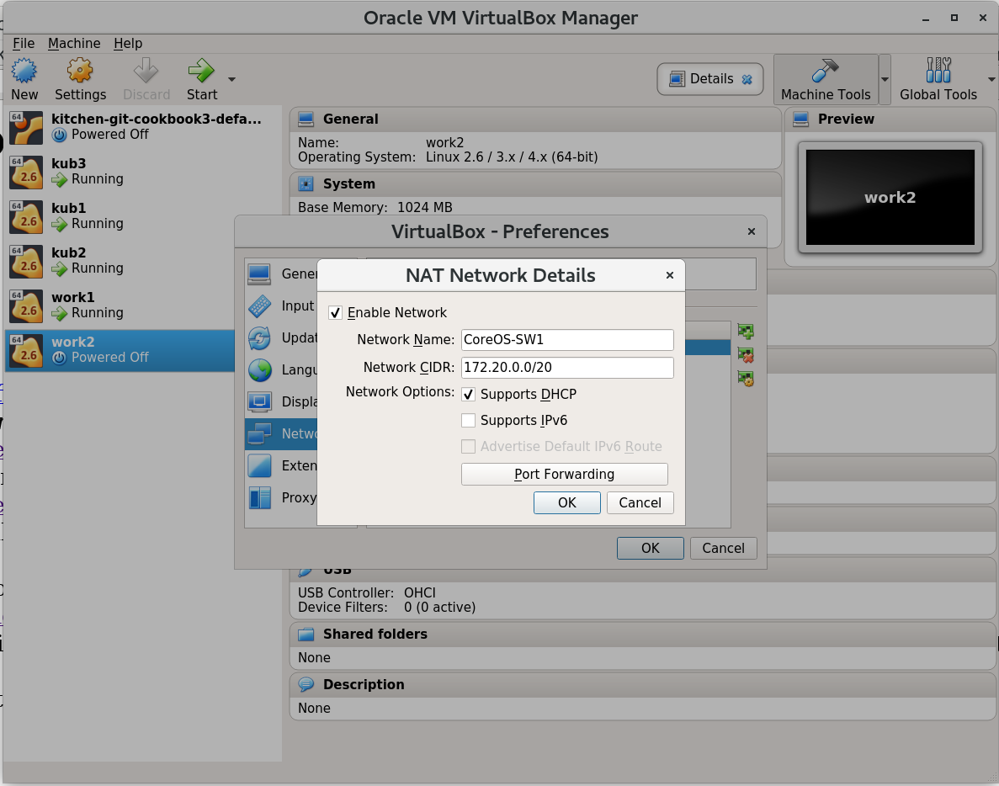
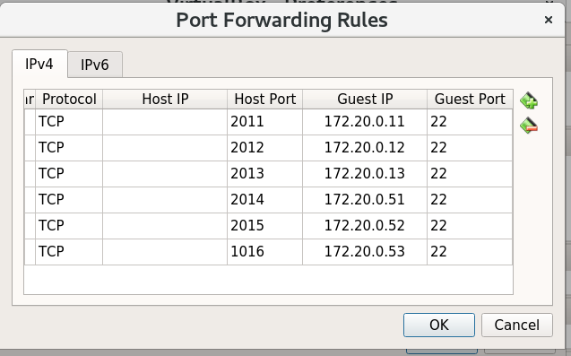
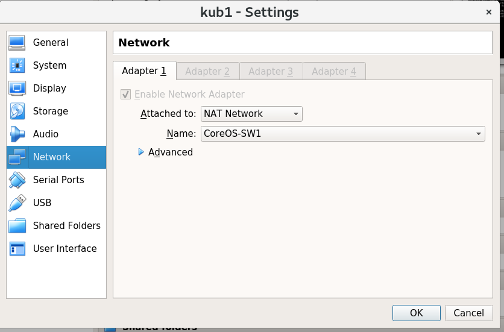

<h1>Virtualbox Kubernetes Master / Worker Nodes Configuration</h1>

To use Virtualbox for testing a Kubernetes Master / Worker Node setup, you must configure a network switch first.

Download a CoreOS ISO, install the OS with coreos-install using the generated ignition script.
 Once installation is completed, before you reboot, follow the instructions below to configure the network.

To create a new network switch, from the main Virtualbox GUI screen.
 Click on File > Preferences >  Network.
 Click on the right button <i>Add  new NAT network</i>
 Something like the screen shut below.

Then name the switch, in this case I used <i>CoreOS-SW1</i>, this name will be used latter on each VM.
 Set the network CIDR, in this case I used <i>172.20.0.0/20</i>.

<b>Something like the screen shut below, Set Network Name and Network Range.</b>
 

Next, click on <i>Port Forwarding</i>, then click on the green + <i>Add new port forwarding rule</i>.
 Create 6 rules, for each master / worker node.

<b>Something like the screen shut below, Set port forwarding rules.</b> 
 
 

Now you <i>NAT Network</i> is all set.

<b>Note: </b>When setting up a new VM, make sure to set 1500/Mb+ Memory(the default is only 1024/Mb), to prevent the Boot stuck at "Starting Switch Root".
 

Next lets move to the VM configuration.
 Click on your VM > Settings > Network.
 Under <i>Attach to:</i> Select <i>NAT Network</i>
 Under <i>Name:</i> Select <i>CoreOS-SW1</i> (or the name used for your switch).

<b>Something like the screen shut below, Set VM Vm Switch.</b> 
 

Click ok to save changes.
 Next, Reboot the node.

To connect to a master / worker, the below should work.
 For example: Master1 if configured port forward was configured to port 2011.
 ssh -p 2011 your_user@localhost

